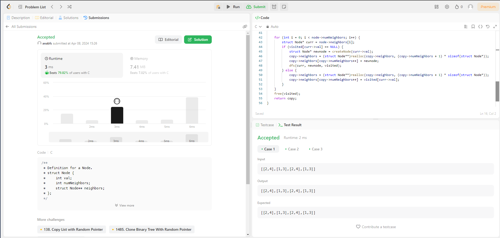

# Grafos 1 - LeetCode

**Número da Lista**: 1 
**Conteúdo da Disciplina**: Grafos1 

## Alunos
|Matrícula | Aluno |
| -- | -- |
| 18/0097181  |  Ana Beatriz Santos |
| xx/xxxxxx  |  xxxx xxxx xxxxx |

## Sobre 
Repositório com resoluções de problemas de grafos do [LeetCode](https://leetcode.com/).

## Apresentação 

## Screenshots

## Exercicio 1 - Clone Graph

Dificuldade: Médio  
Link: [Clone Graph](https://leetcode.com/problems/clone-graph/description/) 
Solução: [Código](assets/codes/clone_graph.c) 
Para resolver esse exercício foi realizada a busca em profundidade (DFS) para percorrer o grafo original, criando uma cópia à medida que avançava. 

## Instalação 
**Linguagem**: C 

Você precisará de um compilador C/C++ instalado em seu sistema para utilizar o código localmente ou apenas criar uma conta no [LeetCode](https://leetcode.com/).

## Uso 
Para executar o trabalho basta abrir o link do exercício e copiar e colar o código. Se for utilizar localmente siga os seguintes comandos:

`gcc -o nomeArquivo nomeArquivo.c`

`./nomeArquivo`

