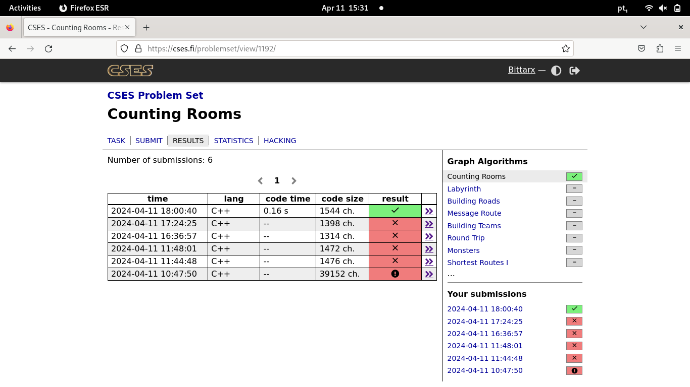

# Grafos 1 - Online Judge

**Número da Lista**: 21 
**Conteúdo da Disciplina**: Grafos1 

## Alunos
|Matrícula | Aluno |
| -- | -- |
| 18/0097181  |  Ana Beatriz Santos |
| 20/0023748  |  Marcos Santos Bittar |

## Sobre 
Repositório com resoluções de problemas de grafos do [LeetCode](https://leetcode.com/) e do [CSES](https://cses.fi/problemset/).

## Apresentação 
<iframe width="560" height="315" src="https://www.youtube.com/embed/vCpV9tP7cCE?si=fWBGvailhDCSbgZ4" title="YouTube video player" frameborder="0" allow="accelerometer; autoplay; clipboard-write; encrypted-media; gyroscope; picture-in-picture; web-share" referrerpolicy="strict-origin-when-cross-origin" allowfullscreen></iframe>

[video2](https://drive.google.com/file/d/1FNlOthSjU_CEzejaBpGX1YNy-S3ce0dj/view?usp=drive_link) 
## Screenshots

### Exercício 1 - Clone Graph

Dificuldade: Médio  
Link: [Clone Graph](https://leetcode.com/problems/clone-graph/description/) 
Solução: [Código](assets/codes/clone_graph.c) 
Para resolver esse exercício foi realizada a busca em profundidade (DFS) para percorrer o grafo original, criando uma cópia à medida que avançava. 

### Exercício 2 - Counting Rooms

Dificuldade: difícil  
Link: [Counting Rooms](https://cses.fi/problemset/task/1192) 
Solução: [Código](assets/codes/countingRooms2.cpp) 
Para resolver esse exercício foi realizada a busca em Largura (bfs) para percorrer a entrada, que foi salva em uma matriz de caracteres. Além disso, para controlar quais dos vértices haviam sido visitados foi utilizada uma matriz de inteiros, contendo 1 para vértices visitados e 0 para vértices não visitados. Finalmente, para saber se a entrada era ou não um vértice analisáva-se o código ascii do caracter na matriz de caracteres, dado que os pontos "." eram vértices e os jogos da velha "#", na prática, não existiam

### Exercício 3 - Binary Tree Maximum Path Sum

Dificuldade: Difícil  
Link: [Binary Tree Maximum Path Sum](https://leetcode.com/problems/binary-tree-maximum-path-sum/description/) 
Solução: [Código](assets/codes/binary_tree.c) 

Para resolver esse exercício o algoritmo percorre a árvore binária em pré-ordem, calculando recursivamente o máximo caminho de soma para cada nó e atualizando o valor máximo global (maxSum) conforme necessário. No final, o valor máximo encontrado é retornado pela função maxPathSum.

## Instalação 
**Linguagem**: C 

Você precisará de um compilador C/C++ instalado em seu sistema para utilizar o código localmente ou apenas criar uma conta no [LeetCode](https://leetcode.com/) ou no [CSES](https://cses.fi/problemset/).

## Uso 
Para executar o trabalho basta abrir o link do exercício e copiar e colar o código. Se for utilizar localmente siga os seguintes comandos:

`gcc -o nomeArquivo nomeArquivo.c`

`./nomeArquivo`

